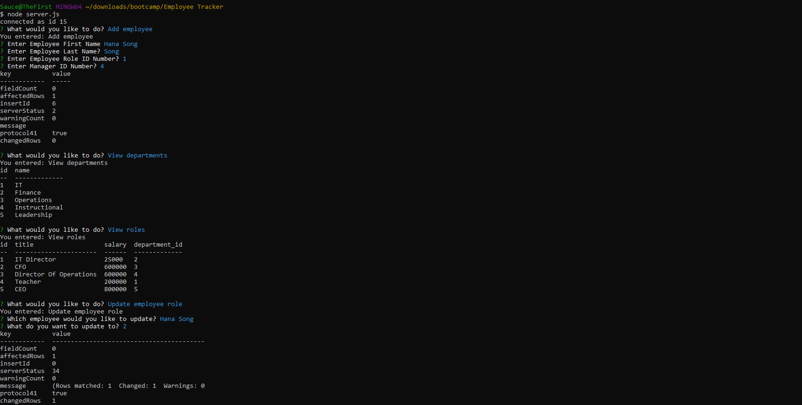

# employee-tracker

## Description

This application demonstrates MySQL's ability to create, edit, and delete data from multiple tables within a database, all using the CLI. 

[Video Functionality Walkthrough](https://youtu.be/fml1u_09InM)

## Technologies Used
MySql
MySQL Command Line
CRUD
Primary Keys
Foreign Keys
Node.js
